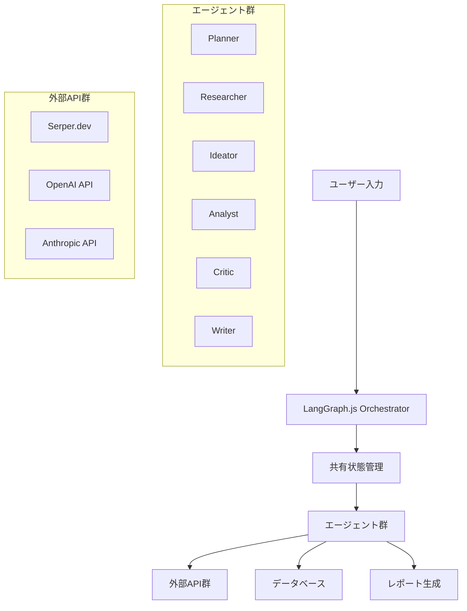

# マルチエージェントAIシステム技術設計書

## 概要

新事業起案のためのマルチエージェントAIツールの技術設計書です。ChatGPTの技術分析と実装アドバイスを基に、LangGraph.jsとNext.jsを使用したエージェント協調システムを構築します。

## システム要件

### 機能要件
- **アイデア創出プロセス**: 調査 → アイデア生成 → 初期評価 → 詳細調査 → レポート生成
- **エージェント協調**: 6つのエージェント（Planner、Researcher、Ideator、Analyst、Critic、Writer）が自律的に協働
- **動的ワークフロー**: 固定順序ではなく、状況に応じてエージェントが柔軟に連携
- **品質保証**: 各段階での品質評価と必要に応じた反復改善

### 技術要件
- **フレームワーク**: LangGraph.js + Next.js 15 (App Router)
- **LLM統合**: OpenAI GPT-4o、Anthropic Claude等の環境変数による動的選択
- **外部API**: Serper.dev（検索）、BeautifulSoup4（スクレイピング）
- **データベース**: Supabase（PostgreSQL）
- **UI**: TailwindCSS + shadcn/ui

## アーキテクチャ設計

### 1. システム全体構成



### 2. エージェント設計

#### Planner（プランナー）
- **役割**: 動的調査計画の立案、状況認識、次アクション決定
- **入力判定**: LLMによる入力の具体性レベル判定
- **出力**: 20-30個の詳細調査項目（JSON構造化）
- **自律性**: 他エージェントの結果を見て再計画

#### Researcher（リサーチャー）
- **役割**: 情報収集・要約、2段階調査（アイデア創出用・詳細分析用）
- **ツール**: Serper.dev API + BeautifulSoup4
- **フェーズ1**: 最先端事例、業界課題、技術トレンド調査
- **フェーズ2**: 市場規模、競合分析、法規制調査
- **自律性**: 「情報不足」を判断して追加調査実行

#### Ideator（アイデア生成者）
- **役割**: ビジネスモデル生成、アイデア洗練
- **入力**: 調査結果、評価フィードバック
- **出力**: 構造化されたビジネスアイデア
- **自律性**: Criticからの要求に応じてアイデア改善

#### Analyst（分析者）
- **役割**: 市場規模算出、競合分析、リスク評価、財務予測
- **ツール**: 計算ツール、財務データAPI統合
- **出力**: 定量的分析結果
- **自律性**: 不足データをResearcherに要求

#### Critic（評価者）
- **役割**: 品質評価、継続/停止判定、改善指示
- **評価基準**: 市場性、実現可能性、三菱地所適合性
- **判定**: 継続/停止/特定エージェントへの改善要求
- **自律性**: 品質基準に基づく動的判定

#### Writer（ライター）
- **役割**: 構造化HTMLレポート生成、品質自己評価
- **テンプレート**: A3横向き、全項目網羅
- **出力**: HTML + CSS（TailwindCSS）
- **自律性**: 情報不足時の追加調査要求

### 3. 技術実装詳細

#### LangGraph.js統合
```javascript
// 基本構造例
import { StateGraph } from "@langchain/langgraph";

const workflow = new StateGraph({
  // 共有状態スキーマ定義
  channels: {
    messages: [],
    research_data: {},
    ideas: [],
    analysis: {},
    report: null
  }
});

// エージェントノード追加
workflow.addNode("planner", plannerAgent);
workflow.addNode("researcher", researcherAgent);
workflow.addNode("ideator", ideatorAgent);
workflow.addNode("analyst", analystAgent);
workflow.addNode("critic", criticAgent);
workflow.addNode("writer", writerAgent);

// 動的ルーティング
workflow.addConditionalEdges(
  "critic",
  (state) => {
    if (state.quality_score >= 0.8) return "writer";
    if (state.needs_research) return "researcher";
    if (state.needs_ideas) return "ideator";
    return "analyst";
  }
);
```

#### 環境変数管理
```javascript
// Next.js環境変数
const config = {
  llm: {
    provider: process.env.LLM_PROVIDER || 'openai',
    model: process.env.LLM_MODEL || 'gpt-4o',
    apiKey: process.env.OPENAI_API_KEY || process.env.ANTHROPIC_API_KEY
  },
  tools: {
    serper: process.env.SERPER_API_KEY
  }
};
```

#### 共有状態管理
```typescript
interface SharedState {
  user_input: string;
  research_phase: 'ideation' | 'analysis' | 'complete';
  research_data: ResearchData[];
  ideas: BusinessIdea[];
  selected_idea: BusinessIdea | null;
  analysis_results: AnalysisResult;
  quality_scores: QualityScore[];
  report: HTMLReport | null;
  agent_history: AgentExecution[];
}
```

## 実装戦略

### 開発アプローチ
ChatGPTは「研究・検証フェーズはLangChain単体で」と提案しましたが、以下の理由で**最初からLangGraph.js**で進めます：

1. **既存環境**: Next.js環境が整備済み
2. **明確な要件**: マルチエージェント協調が確実に必要
3. **最終目標**: 長時間実行・耐障害性が必要

### 段階的実装計画

#### Phase 1: 基盤構築（Task 5）
- LangGraph.js + Next.js API統合
- 環境変数管理
- 共有状態設計
- エラーハンドリング基盤

#### Phase 2: 調査エージェント（Task 6）
- Planner + Researcher実装
- Serper.dev統合
- 動的調査計画機能

#### Phase 3: アイデア生成（Task 7）
- Ideator + Critic実装
- 初期評価システム
- 反復改善ループ

#### Phase 4: 詳細分析（Task 8）
- Analyst実装
- 市場分析機能
- エージェント間協調

#### Phase 5: レポート生成（Task 9）
- Writer実装
- HTMLテンプレート
- 品質保証システム

#### Phase 6: 統合・最適化（Task 10）
- 全エージェント統合
- 動的ルーティング
- パフォーマンス最適化

## 品質保証

### テスト戦略
- **単体テスト**: 各エージェントの入出力検証
- **統合テスト**: エージェント間協調の検証
- **エンドツーエンドテスト**: 完全ワークフローの検証
- **障害テスト**: エラーハンドリング・リトライ機能

### 監視・ログ
- **LangSmith**: トレース、コスト、エラー可視化
- **カスタムログ**: エージェント実行履歴、状態遷移
- **パフォーマンス監視**: 実行時間、API呼び出し頻度

## 運用考慮事項

### セキュリティ
- API キーの環境変数管理
- Supabase RLS（Row Level Security）
- CSRF保護
- 入力検証・サニタイゼーション

### スケーラビリティ
- API レート制限対応
- 並列実行最適化
- キャッシュ戦略
- コスト制御（月次上限）

### 保守性
- TypeScript型定義
- API契約書
- エージェント設計パターン
- 設定の外部化

## 参考資料

### 技術ドキュメント
- [LangGraph.js Documentation](https://langchain-ai.github.io/langgraphjs/)
- [Next.js 15 App Router](https://nextjs.org/docs)
- [LangChain.js](https://js.langchain.com/)

### 設計パターン
- Multi-Agent Systems
- Event-Driven Architecture
- State Management Patterns
- Error Handling Strategies

---

**作成日**: 2025年1月XX日  
**最終更新**: 2025年1月XX日  
**バージョン**: 1.0 